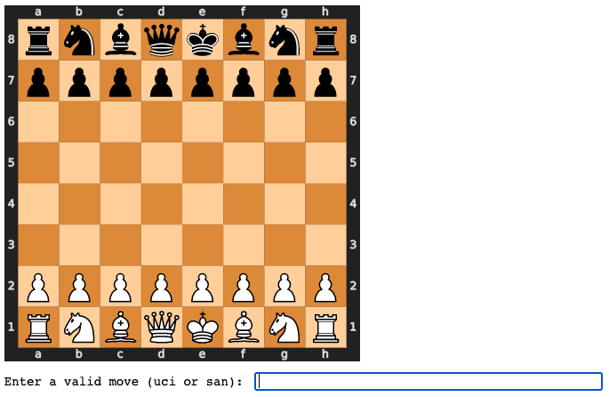
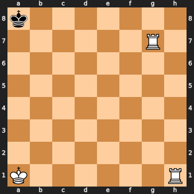

# superchess - a _super_ simple _chess_ engine

Are you a [user](#for-users) or a [developer](#for-developers)?

### For users

There's only two simple steps in order to play against our chess engine.

#### 1. Installing

Installation is as simple as
```
pip install .
```

#### 2. Playing

To play a game against an alphabeta of depth3 opponent, simply type
```
python3 examples/qtgui.py
```

If for any reason the gui experiences problems, once can also use a simpler keyboard-based input method jupyter notebooks (see the [gui](#gui) section for more info). First [download jupyter](https://jupyter.org/install), then open the examples/play_against_computer.ipynb notebook:
```
cd examples
jupyter notebook
# open play_against_computer.ipynb through the jupyter API
```

and play!



Moves have to be entered manually, using either of
- Standard Algebraic Notation (e4, Nf3, exd5, etc.)
- Universal Chess Interface (e2e4, g1f3, e4d5, etc.)

-------------------------------------

### For developers

#### Installation

As a developer it's better to install superchess using
```
pip install -e .
```
This will keep track of the changes you make to files, and you won't need to reinstall superchess after every change.

#### Unit Testing

Unit tests can be run from the `tests` folder by running
```
python3 -m unittest
```

#### GUI

We use [python-chess](https://python-chess.readthedocs.io/en/latest/) as a frontend, which generates svg images, and so the GUI needs to show this svg image and then ask the user for move input. There are two GUIs implemented, one for which the input is click-based and another for which it is keyboard-based.

The mouse/click-based GUI is the main one, and is implemented using [PySide2](https://wiki.qt.io/Qt_for_Python). The code can be found in `examples/qtgui.py`.

The keyboard-based gui uses IPython's [Display](https://ipython.readthedocs.io/en/stable/api/generated/IPython.display.html) function, and needs to be ran inside a jupyter notebook.

#### alpha-beta pruning misses checkmates in 1!

Can you find the checkmate in 1?



The classical [alphabeta](https://en.wikipedia.org/wiki/Alpha%E2%80%93beta_pruning#Pseudocode) algorithm with a depth of 3 misses it! This is because moving the King or Rook on h1 first still leads to a checkmate, and alphabeta doesn't distinguish between checkmates that happen in one move or those that happen in three! This is why our implementation [alphabeta_treesearch](./superchess/search.py) returns (best_score, depth, best_moves), where depth is used to distinguish between moves with the same score that otherwise look equivalent to alphabeta.
